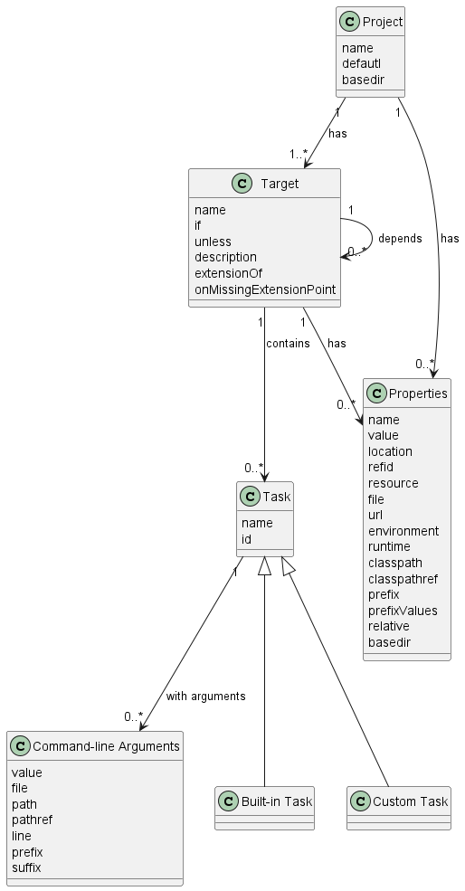

# EDOM Project, Part 1 - Team Report

In this folder you should add **all** artifacts developed for part 1 of the EDOM project, related to team/group work.

**Note:** If for some reason you need to bypass these guidelines please ask for directions with your teacher and **always** state the exceptions in your commits and issues in bitbucket.

Following there are examples of proposed sections for this part of the report (team part).

# Domain Knowledge Obtained from Analyzing the Applications

## Make 

A makefile is simply a way of associating short names, called targets, with a series of commands to execute when the action is requested. For instance, a common makefile target is "clean," which generally performs actions that clean up after the compiler--removing object files and the resulting executable.

Make, when invoked from the command line, reads a makefile for its configuration. If not specified by the user, make will default to reading the file "Makefile" in the current directory. Generally, make is either invoked alone, which results in the default target, or with an explicit target. 

### Targets
Targets are the heart of what a makefile does: they convert a command-line input into a series of actions. For instance, the "make clean" command tells make to execute the code that follows the "clean" target. Targets have three components: the name of the target, the dependencies of the target, and finally the actions associated with the target:

target : [dependencies]
        <command 1>
        <command 2>
        ..

The dependencies associated with a target are either other targets or files themselves. If they're files, then the target commands will only be executed if any of the dependent files have changed since the last time the command was executed. If the dependency is another target, then that target's commands will be evaluated in the same way.

### Make model


## Gradle

Gradle is a build automation tool known for its flexibility to build software. A build automation tool is used to automate the creation of applications. The building process includes compiling, linking, and packaging the code. The process becomes more consistent with the help of build automation tools.

### Why is Gradle Used? 

#### Gradle resolves all the issues faced on other build tools like Maven and ANT.
#### The tool focuses on maintainability, usability, extendibility, performance, and flexibility. 
#### It is well-known to be highly customizable when it comes to different projects dealing with various technologies. We may use Gradle in several ways, like Java projects, Android projects, and Groovy projects.
#### Gradle is popular to provide high-speed performance, nearly twice as fast as Maven.
#### The tools support a wide variety of IDE's, which provide a better user experience, as different people prefer working on a different IDE. It provides the users that like to work on the terminal with the command-line interface, which offers features like Gradle tasks, Command line completion, etc.

### The following is a high-level overview of some of its most important features:

#### High performance;

Gradle avoids unnecessary work by only running the tasks that need to run because their inputs or outputs have changed.
You can also use a build cache to enable the reuse of task outputs from previous runs or even from a different machine (with a shared build cache).

#### JVM foundation;

Gradle runs on the JVM and you must have a Java Development Kit (JDK) installed to use it. This is a bonus for users familiar with the Java platform
as you can use the standard Java APIs in your build logic, such as custom task types and plugins. It also makes it easy to run Gradle on different platforms

#### Conventions;

Gradle takes a leaf out of Maven’s book and makes common types of projects — such as Java projects — easy to build by implementing conventions.

#### Extensibility;

You can readily extend Gradle to provide your own task types or even build model.

#### IDE support;

Several major IDEs allow you to import Gradle builds and interact with them: Android Studio, IntelliJ IDEA, Eclipse, and NetBeans. Gradle also has support for generating the solution
files required to load a project into Visual Studio.

### TIPS

1- Gradle makes few assumptions about what you’re trying to build or how it should be done.

2- Gradle models its builds as Directed Acyclic Graphs (DAGs) of tasks (units of work). What this means is that a build essentially configures a set of tasks and wires them together —
based on their dependencies — to create that DAG. Once the task graph has been created, Gradle determines which tasks need to be run in which order and then proceeds to execute them.

Actions — pieces of work that do something, like copy files or compile source

Inputs — values, files and directories that the actions use or operate on

Outputs — files and directories that the actions modify or generate

### Gradle has several fixed build phases

It’s important to understand that Gradle evaluates and executes build scripts in three phases:

#### Initialization

Sets up the environment for the build and determine which projects will take part in it.

#### Configuration

Constructs and configures the task graph for the build and then determines which tasks need to run and in which order, based on the task the user wants to run.

#### Execution

Runs the tasks selected at the end of the configuration phase.

### Gradle Core Concepts

#### Projects
A project represents a thing that is to be done, like deploying applications to staging environments. A Gradle project requires a set of tasks to execute.


#### Tasks 
A task refers to a piece of work performed by a build. It might be something as simple as compiling classes, creating JAR files, making Javadoc, or publishing some archives.


#### Build Scripts
A build script is known as build.gradle and is located in the root directory of the project. Every Gradle build comprises one or more projects.

### Gradle model
Every Gradle build is made up of one or more projects.
Each project is made up of one or more tasks.
A task, as the name suggests, is a representation of actions (default or custom) that need to be executed during the build process. For example, the compilation of Java code is started by a task. Tasks are defined in the project build script and can have dependencies with each other. this, A Task represents a single atomic piece of work for a build.

Task has following:
Has a Lifecycle
Has Properties
Has Actions & Methods
Has Dependencies
Script Block

It's also allowed for the user to use simple logic decision constructs inside the actions, such as if conditions and cycles. He can also use variables in those constructs.


## Ant

Apache Ant is a Java library and command-line tool whose mission is to drive processes described in build files as targets and extension points dependent upon each other. The main known usage of Ant is the build of Java applications. Ant supplies a number of built-in tasks allowing to compile, assemble, test and run Java applications. Ant can also be used effectively to build non Java applications, for instance C or C++ applications. More generally, Ant can be used to pilot any type of process which can be described in terms of targets and tasks.

Ant is written in Java. Users of Ant can develop their own "antlibs" containing Ant tasks and types, and are offered a large number of ready-made commercial or open-source "antlibs".

Ant is extremely flexible and does not impose coding conventions or directory layouts to the Java projects which adopt it as a build tool. 

#### Projects
It is the root element of the build.xml file.

#### Properties
Properties are an important way to customize a build process or to just provide shortcuts for strings that are used repeatedly inside a buildfile. 

A property can be read from a file or a classpath resource using file and resource attributes respectively. The value of the property can be accessed using ${propertyName}.

#### Tasks 
A task is a piece of code that can be executed.

A task can have multiple attributes (or arguments, if you prefer). The value of an attribute might contain references to a property. These references will be resolved before the task is executed.

#### Targets
A target is used to group the tasks and can be run directly via Ant. A target can be dependent on other target. If a target depends on other one or more targets then ant will automatically execute the dependent targets.

### Ant model


# Design of the Metamodel

To design our Metamodel we looked to the previous models built on Activity 3 and combine them all resulting on the next Metamodel:


We combined similar instances between the the three build languages such as Task, Target, Property and Project and also added relevent ones in each individual language such as Action. With the metamodel done we become closer to building our new DSL.

# Constraints and Refactorings

## Constraints
| Model Class | Constrain| Code |
| -------------- | :--------- | :---------- | 
| Project | Name can't be null or empty | invariant mustHaveName: not self.name.oclIsUndefined();| 
| Project | Version can't be null or empty | invariant mustHaveVersion: not self.version.oclIsUndefined();| 
| File | Name can't be null or empty | invariant mustHaveName: not self.name.oclIsUndefined();| 
| Task | Name can't be null or empty | invariant mustHaveName: not self.name.oclIsUndefined();| 
| Task | Name must be unique| invariant nameMustBeUnique: Task.allInstances()->isUnique(e | e.name);| 
| Property | Name can't be null or empty | invariant mustHaveName: not self.name.oclIsUndefined();| 
| Property | Value can't be null or empty | invariant mustHaveValue: not self.value.oclIsUndefined();| 
| Property | Name must be unique| invariant nameMustBeUnique: Property.allInstances()->isUnique(e | e.name);| 

## Refactorings
Looking at our constraints we as a group did not find necessary transformations to solve them. If a value is empty we should not write a random value just to proceed with the action and if we find a repeated value we should not randomize it as well, the user must know the values of all the elements on the metamodel.

# Metamodel Graphical Representation
To build our metamodel graphical representation we created a java class named GeneratePlantUML.
This class walks through our metamodel elements, represents them graphically, distinguishing them by their names and also creates their relationships. At the end we have a .puml file that we can view with our graphical representation complete.

## Model
It's represented as a class, since it's always only one element the class name is Model. This class has an attribute name that's represented.

Ex .puml:
#### class Model {
#### name ModelBuilder
#### }

## Project
It's represented as a class, since it's always only one element the class name is Project. This class has an attribute name and one value that's represented.

Ex .puml:
#### class Project {
#### name ModelBuilderProject
#### version v1.20.0
#### }

## Target
It's represented as a class, and it's name depends on the name of the file related to it. If we have a file named "CleanDish.java", the target class will be represented as "Target_CleanDish_java" graphically. 

Ex .puml:
#### class Target_CleanDish_java {
#### }

## File
It's represented as a class, and it's name depends on the name of the file. If we have a file named "CleanDish.java", the file class will be represented as "File_CleanDish_java" graphically. 

Ex .puml:
#### class File_CleanDish_java {
#### name CleanDish.java
#### }

## Task
It's represented as a class, and it's name depends on the name of the task. If we have a task named "do the dishes", the task class will be represented as "Task_do_the_dishes" graphically. This class has an attribute name and one description that's represented.

Ex .puml:
#### class Task_do_the_dishes {
#### name do the dishes
#### description in this task the dishes will be cleaned
#### }

## Action
It's represented as a class, and it's name depends on the name of the action. If we have a action named "clean round dish", the action class will be represented as "Action_clean_round_dish" graphically. This class has an attribute name that's represented.

Ex .puml:
#### class Action_clean_round_dish {
#### name clean round dish
#### }

## Decision
It's represented as a class, and it's name depends on the name of the action related to it. If we have a action named "clean round dish", the decision class will be represented as "Decision_clean_round_dish" graphically.

Ex .puml:
#### class Decision_clean_round_dish {
#### }

## Start
It's represented as a class, and it's name depends on the name of the action related to it. If we have a action named "clean round dish", the start class will be represented as "Start_clean_round_dish" graphically.

Ex .puml:
#### class Start_clean_round_dish {
#### }

## End
It's represented as a class, and it's name depends on the name of the action related to it. If we have a action named "clean round dish", the end class will be represented as "End_clean_round_dish" graphically.

Ex .puml:
#### class End_clean_round_dish {
#### }

## InstructionBlock
It's represented as a class, and it's name depends on the name of the action related to it. If we have a action named "clean round dish", the instruction block class will be represented as "InstructionBlock_clean_round_dish" graphically.

Ex .puml:
#### class InstructionBlock_clean_round_dish {
#### }

## Instruction
It's represented as a class, and it's name depends on the name of the instruction. If we have a instruction named "clean", the instruction class will be represented as "Instruction_clean" graphically.

Ex .puml:
#### class Instruction_clean {
#### name clean       
#### }

## Property
It's represented as a class, and it's name depends on the name of the property. If we have a property named "cleanIfTrue", the property class will be represented as "Property_cleanIfTrue" graphically. This class has an attribute name and value that's represented.

Ex .puml:
#### class Property_cleanIfTrue {
#### name cleanIfTrue
#### value boolean
#### }

# Presentations of Models (instances)

## Model A:

Specify a simple model for the building of a java console application made of at least 2 java classes and dependent on at least one jar file.
Include also a "task" to delete the temporary files (files generated by the build)

### Model Created


### Model Xmi

```
<?xml version="1.0" encoding="UTF-8"?>
<assignment1:Model
    xmi:version="2.0"
    xmlns:xmi="http://www.omg.org/XMI"
    xmlns:xsi="http://www.w3.org/2001/XMLSchema-instance"
    xmlns:assignment1="http://www.example.org/assignment1"
    xsi:schemaLocation="http://www.example.org/assignment1 assignment1.ecore"
    name="ModelJavaBuilder">
  <project name="JavaBuilder"
      version="v.1.30.2">
    <target>
      <has name="build classes"
          description="this java class is responsible of building other classes">
        <has
            name="build"
            value="build"/>
      </has>
      <output
          name="BuildClasses.java"/>
    </target>
    <target>
      <has name="create jars"
          description="this java class is responsible for the creation of jar files">
        <has
            name="dist"
            value="dist"/>
      </has>
      <output
          name="CreateAJar.java"/>
    </target>
    <target>
      <has name="nonExplicit"
          description="2 java classes on this builder depend on this jar file">
        <has
            name="src"
            value="src"/>
      </has>
      <output
          name="CreatedJar.jar"/>
    </target>
    <tasks name="deleteFiles"
        description="task to delete the temporary files generated by the build">
      <has name="del"
          value="del"/>
      <actions
          name="delete jar files">
        <has>
          <has
              name="deleting files"/>
          <has
              name="cleanBuild"/>
        </has>
        <decisions>
          <has
              name="deleteAllJar"
              value="boolean"/>
        </decisions>
      </actions>
    </tasks>
  </project>
</assignment1:Model>
```

### Model generated by our class generatePuml.java


## Model B:

Specify a simple model for the building of a c/c++ console application made of at least 2 c/c++ files (also include some header files)
and dependent on at least one lib file. Include also a "task" to delete thetemporary files (files generated by the build)

### Model Created


### Model Xmi

```
<?xml version="1.0" encoding="UTF-8"?>
<assignment1:Model
    xmi:version="2.0"
    xmlns:xmi="http://www.omg.org/XMI"
    xmlns:xsi="http://www.w3.org/2001/XMLSchema-instance"
    xmlns:assignment1="http://www.example.org/assignment1"
    xsi:schemaLocation="http://www.example.org/assignment1 assignment1.ecore"
    name="ModelCBuilder">
  <project name="CBuilder"
      version="v.22.30.2">
    <target>
      <has name="build classes"
          description="this c class is responsible of building other classes">
        <has
            name="build"
            value="build"/>
      </has>
      <output
          name="BuildClasses.c"/>
    </target>
    <target>
      <has name="build dependencies"
          description="this class is responsible for the connecting the dependencies">
        <has
            name="buildDep"
            value="buildDep"/>
      </has>
      <output
          name="BuildDependencies.c"/>
    </target>
    <target>
      <has name="InformationLibrary"
          description="File contains a library of information used by a specific program. It may store a variety of information.">
        <has
            name="lib"
            value="lib"/>
      </has>
      <output
          name="InfoBuilder.lib"/>
    </target>
    <target>
      <has name="DeclarationsToShare"
          description="C function declarations and macro definitions to be shared between several source files.">
        <has
            name="dec"
            value="dec"/>
      </has>
      <output
          name="header.h"/>
    </target>
    <tasks name="deleteFiles"
        description="task to delete the temporary files generated by the build">
      <has name="del"
          value="del"/>
      <actions
          name="delete jar files">
        <decisions>
          <has
              name="isTempFile"
              value="boolean"/>
        </decisions>
      </actions>
    </tasks>
  </project>
</assignment1:Model>
```

### Model generated by our class generatePuml.java
