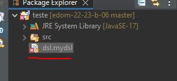

# EDOM Project, Part 1, Tool 2

In this folder you should add **all** artifacts developed for part 1 of the EDOM Project, related to tool 2.

You should also include in this file the report for this part of the project (only for tool 2).

## Description of the Tool

Xtext is a framework for development of programming languages and domain-specific languages. With Xtext you define your language using a powerful grammar language.
It covers all aspects of a complete language infrastructure, from parsers, over linker, compiler or interpreter to fully-blown top-notch IDE integration for Eclipse and Web-based IDEs. Further, languages developed with Xtext can be integrated into editors supporting the Language Server Protocol (like V.S Code). Xtext comes with great defaults for all these aspects, which at the same time can be easily tailored to your individual needs.

## How to Setup and Install

#### 1- First you need to install eclipse.
#### 2- To install Xtext on Eclipse we need to open the application and select "Help".
#### 3- After that we select "Install new software" and a new window will open up.
#### 4- On the left of the "Add" button we got a bar textbox and we should select the option "2022-09 - https://download.eclipse.org/releases/2022-09".
#### 5- A list will appear, we should select the Modeling box and install it. This package will contain Xtext.

## Implementation of the Metamodel

After creating a metamodel based on EMF in the group part of this iteration, it was generated the model code of the Ecore based model.

After that, the EMF project was configured to Xtext.

Finally, I used the wizard "Xtext Project from Existing Ecore Models" to create an XText DSL.

## Implementation of Constraints and Refactorings

After creating the XText DSL, the Xtext artifacts were generated by executing the mwe2 file. 

To implement the constraints, a class generated by the mwe2 file was used named DslValidator (Dsl is the name of the Xtext file).

### Contraints applied

| Model Class | Constrain| 
| -------------- | :--------- |
| Project | Name can't be null or empty |  
| Project | Version can't be null or empty | 
| Task | Name can't be null or empty | 
| Task | Name must be unique| 
| File | Name can't be null or empty |
| Property | Name can't be null or empty |
| Property | Name must be unique |

## Implementation of the Visualizations

To implement visualization, some code was created in the method doGenerate of the DslGenerator class.

## Implementation of Models (instances)

I was unable to create the instances correctly, so I only created an instance to prove that the constraints are working properly.

## Execution of Constraints and Refactorings

To execute and see, if the constraints are working properly, first you need to run another Eclipse application on the main xtext folder.

After the other application starts, you need to create a file with the extension you chose when creating the Xtext. In my case, the extension is mydsl.

Finally, you need to start building the model in that file. If the rules created in the DslValidator class are not respected, eclipse will send an error message.

In this case, this dsl file is missing a name and a version on the project.
The warnings sent by the DslValidator are marked in red.

## Generation/Execution of Visualizations

To generate the visualization, all you need to do is build the Xtext project by running another Eclipse application, like it was explained in the Execution of Constraints and Refactorings topic. The visualization will generate as long as there is no errors on the dsl file it is using.
The file generated, will appear in the src-gen package of the main Xtext package.
Since I was unable to create the instances correctly, I was unable to generate them.