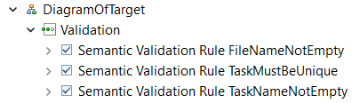

# EDOM Project, Part 1, Tool 3

In this folder you should add **all** artifacts developed for part 1 of the EDOM Project, related to tool 3.

You should also include in this file the report for this part of the project (only for tool 3).

**Note:** If for some reason you need to bypass these guidelines please ask for directions with your teacher and **always** state the exceptions in your commits and issues in bitbucket.

Following there are examples of proposed sections for the report.

**Note: On some markdown tables we will have \ instead of | to not deformat** 

# Description of the Tool
Sirius is an open-source software project of the Eclipse Foundation. This technology allows users to create custom graphical modeling workbenches by leveraging the Eclipse Modeling technologies, including EMF and GMF. The modeling workbench created is composed of a set of Eclipse editors (diagrams, tables and trees) which allow the users to create, edit and visualize EMF models.

## History 
Sirius is the result of a partnership launched in 2007 between Thales and Obeo. The initial goal was to provide a generic workbench for model-based architecture engineering that could be tailored to fit specific needs.
In 2013, the project was released in Open Source under the scope of the Eclipse Foundation. Sirius is integrated into annual release train of the Eclipse platform.

## Uses
Sirius is mainly used to design complex systems (industrial systems or IT applications). The first use case was Capella, a Systems Engineering workbench contributed to the Eclipse Working Group PolarSys in 2014 by Thales.
The Sirius gallery on the project website lists some of the projects using Sirius.

## Compatibility
The latest release of Sirius is compatible with the following version of Eclipse:
###### -Eclipse Oxygen
###### -Eclipse Neon
###### -Eclipse 2020-09
Sirius is based on the modeling framework EMF. Thus it is compatible with any tool that can produce EMF compatible models.

# How to Setup and Install
#### 1- To install Sirius on Eclipse we need to open the application and select "Help". 
#### 2- After that we select "Install new software" and an Install window will open up.
#### 3- On the left of the "Add" button we got a bar textbox and we should select the option "2022-09 - https://download.eclipse.org/releases/2022-09".
#### 4- A list will appear, we should select the Modeling box and install it. This box contains Sirius.

# Implementation of the Metamodel

To begin our implementation of the Metamodel on Sirius we should use our package created in the group part of this iteration 1, that already contains our Metamodel in this case, cr2.ecore .


We will need some other packages such as Model Code, Edit Code and Editor Code. To do this we should open the file cr2.genmmodel and when it's open click the generate all option.


As we can see now we have three complete projects, plugin type projects, that allow us to add functionalities to the eclipse.


To activate these plugins on Eclipse we should run another Eclipse where they are installed in. To do this we should define a new configuration to run an application where the Plug-ins window should launch with "all workspace and enabled target plug-ins".

After defining this new configuration we should run an application with it and a new Eclipse Window will open up, letting us use the three plug-ins and working with Sirius using our Metamodel elements.


# Implementation of Constraints and Refactorings

When we open up the new Eclipse Window with Sirius we are still not ready to do the Constraints and Refactorings.

We need to create a new Viewpoint Specification Project.

It creates an odesign file with Viewpoints that makes us able to declare representations of our Metamodel, creating and defining diagrams that makes us able to visualize and edit elements of our metamodel.

I created four Diagrams that cover all of our metamodel:

## DiagramOfProject

This Diagram is composed by a Container Project and two Nodes inside of it, NodeTarget and NodeTask, representing this part of our metamodel:


### Applying Contraints 

Based on our Contraints, since we have Tasks and Projects in this diagram we will need to apply four constraints.

| Model Class | Constrain| Code |
| -------------- | :--------- | :---------- | 
| Project | Name can't be null or empty | invariant mustHaveName: not self.name.oclIsUndefined();| 
| Project | Version can't be null or empty | invariant mustHaveVersion: not self.version.oclIsUndefined();| 
| Task | Name can't be null or empty | invariant mustHaveName: not self.name.oclIsUndefined();| 
| Task | Name must be unique| invariant nameMustBeUnique: Task.allInstances()->isUnique(e \ e.name);| 

To do this we need to create Validations in our Diagram.


Inside of them we need to create Audit with aql code that differs from ocl in some cases.
OclIsUndefined() function does not exist on aql for example. 
Our audits expressions looked like this:

| Model Class | Constrain| Code |
| -------------- | :--------- | :---------- | 
| Project | Name can't be null or empty | aql:self.project->select(p \p.name=null)->isEmpty()| 
| Project | Version can't be null or empty | aql:self.project->select(p \ p.version=null)->isEmpty()| 
| Task | Name can't be null or empty | aql:self.task->select(t \ t.name=null)->isEmpty()| 
| Task | Name must be unique| aql: self.task->isUnique(select(t \ t.name))| 

## DiagramOfTarget

This Diagram is composed by Container Target and two Nodes inside of it, NodeTask and NodeFile. NodeTask has a Bordered NodeTask and NodeFile has a BorderFileTarget to cover all the relationships between elements.


### Applying Contraints 

Based on our Contraints, since we have Tasks and Files in this diagram we will need to apply three constraints.

| Model Class | Constrain| Code |
| -------------- | :--------- | :---------- | 
| File | Name can't be null or empty | invariant mustHaveName: not self.name.oclIsUndefined();| 
| Task | Name can't be null or empty | invariant mustHaveName: not self.name.oclIsUndefined();| 
| Task | Name must be unique| invariant nameMustBeUnique: Task.allInstances()->isUnique(e \ e.name);| 

To do this we need to create Validations in our Diagram.



Inside of them we need to create Audit with aql code that differs from ocl in some cases.
OclIsUndefined() function does not exist on aql for example. 
Our audits expressions looked like this:

| Model Class | Constrain| Code |
| -------------- | :--------- | :---------- | 
| File | Name can't be null or empty | aql:self.file->select(f \ f.name=null)->isEmpty()| 
| Task | Name can't be null or empty | aql:self.task->select(t \ t.name=null)->isEmpty()| 
| Task | Name must be unique| aql: self.task->isUnique(select(t \ t.name))| 


## DiagramTask

This Diagram is composed by a Container Task and two Nodes inside of it, NodeAction and NodeProperty, representing this part of our metamodel:


### Applying Contraints 

Based on our Contraints, since we have Tasks and Property in this diagram we will need to apply five constraints.

| Model Class | Constrain| Code |
| -------------- | :--------- | :---------- | 
| Task | Name can't be null or empty | invariant mustHaveName: not self.name.oclIsUndefined();| 
| Task | Name must be unique| invariant nameMustBeUnique: Task.allInstances()->isUnique(e | e.name);| 
| Property | Name can't be null or empty | invariant mustHaveName: not self.name.oclIsUndefined();| 
| Property | Value can't be null or empty | invariant mustHaveValue: not self.value.oclIsUndefined();| 
| Property | Name must be unique| invariant nameMustBeUnique: Property.allInstances()->isUnique(e | e.name);| 

To do this we need to create Validations in our Diagram.


Inside of them we need to create Audit with aql code that differs from ocl in some cases.
OclIsUndefined() function does not exist on aql for example. 
Our audits expressions looked like this:

| Model Class | Constrain| Code |
| -------------- | :--------- | :---------- | 
| Task | Name can't be null or empty | aql:self.task->select(t \ t.name=null)->isEmpty()| 
| Task | Name must be unique| aql: self.task->isUnique(select(t \ t.name))| 
| Property | Name can't be null or empty | aql:self.property->select(p \ p.name=null)->isEmpty()| 
| Property | Value can't be null or empty | aql:self.property->select(p \ p.value = null)->isEmpty()| 
| Property | Name must be unique| aql: self.property->isUnique(select(p \p.name))| 

## DiagramOfAction

This Diagram is composed by Container Action and two Containers inside of it, ContainerInstructionBlock and ContainerDecision. 
ContainerIntructionBlock has a NodeInstruction.
ContainerDecision has a NodeProperty


### Applying Contraints 

Based on our Contraints, since we have Properties in this diagram we will need to apply three constraints.

| Model Class | Constrain| Code |
| -------------- | :--------- | :---------- |  
| Property | Name can't be null or empty | invariant mustHaveName: not self.name.oclIsUndefined();| 
| Property | Value can't be null or empty | invariant mustHaveValue: not self.value.oclIsUndefined();| 
| Property | Name must be unique| invariant nameMustBeUnique: Property.allInstances()->isUnique(e | e.name);| 

To do this we need to create Validations in our Diagram.


Inside of them we need to create Audit with aql code that differs from ocl in some cases.
OclIsUndefined() function does not exist on aql for example. 
Our audits expressions looked like this:

| Model Class | Constrain| Code |
| -------------- | :--------- | :---------- | 
| Property | Name can't be null or empty | aql:self.property->select(p \ p.name=null)->isEmpty()| 
| Property | Value can't be null or empty | aql:self.property->select(p \ p.value = null)->isEmpty()| 
| Property | Name must be unique| aql: self.property->isUnique(select(p \p.name))| 

# Implementation of the Visualizations

Created a method:
``` 
public void generatePlantuml(Model model) {
```
On the class Services.java (you can see the full method on the project in this folder)

To import the elements of my Metamodel I add this line to manifest.mf : sirius.assignment.cr2;bundle-version="0.1.0"


# Implementation of Models (instances)

To implement the models on Sirius we need to create cr2 files. 

## Model A


## Model B 


# Execution of Constraints and Refactorings

To see our Contraints work we should create a new Modeling Project and inside of it we should create a Cr2 Model file. With it we can define our Model Object and test our constraints and refactorings in general. We can also create the diagrams previously explained to generate a graphical view of our Cr2 Model file and see the errors appearing.


For example if we try to get 2 similar tasks connected to the same project we should get the constraints error message for Tasks and Properties, since tasks names must
be unique and Properties must be unique as well.

Using this diagram with the Project CBuilder we see a task called deleteFiles.


If we duplicate the task deleteFiles


We get the following erros:


# Generation/Execution of Visualizations

To generate the visualization of our models we will use the generatePlantuml function stated previously.

On our Viewpoints I selected the diagramOfProject that has Model as the Domain Class and created this section:


## **Model A**


Created a new representation of the first Model based on the diagramOfProject, after that we generate the puml file.


After that we went to the folder defined in the generatePlantuml function:


And got the next diagram:


## **Model B**

We followed the same steps documented on Model A and obtained the following diagram:

