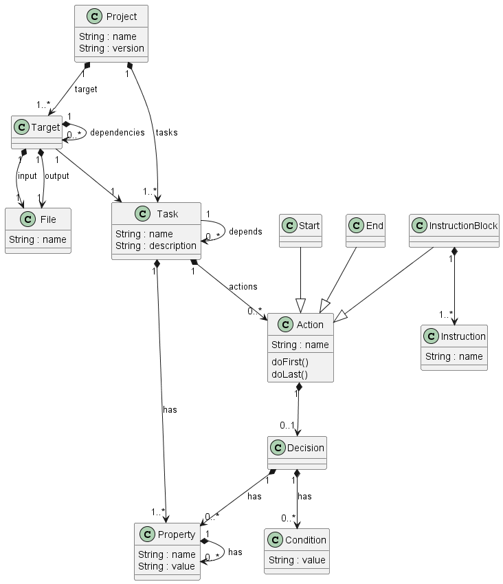
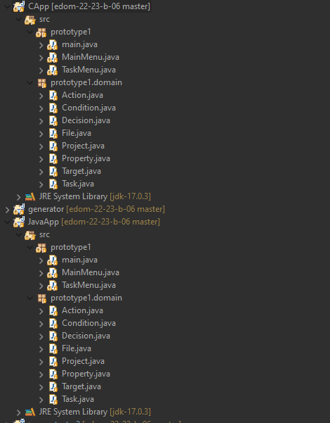
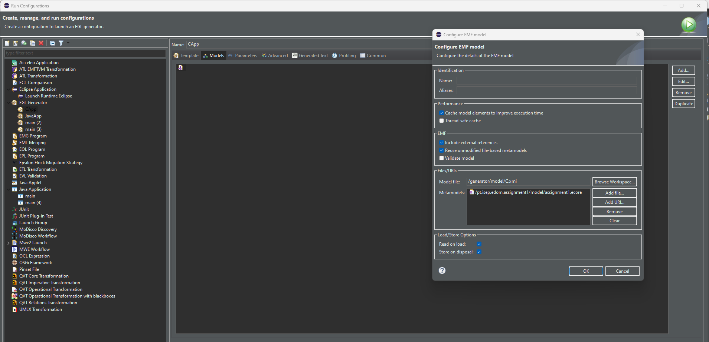

# EDOM Project, Part 2 - Team Report

In this folder you should add **all** artifacts developed for part 2 of the EDOM project, related to team/group work.

**Note:** If for some reason you need to bypass these guidelines please ask for directions with your teacher and **always** state the exceptions in your commits and issues in bitbucket.

Following there are examples of proposed sections for this part of the report (team part).

## Activity 1 - Design Concrete Syntax for the DSL.

First of all, after our Part 1 of this project we needed to make some changes to our metamodel in general, add some constrains and transformations.

### New Metamodel


Basically we removed unnecessary actions such as ClosureBackedAction, DefaulAction and CustomAction. We also made the Decision Loop a lot easier. Removing the ifDecision, WhileDecision and LoopDecision we simply added the Type of Condition that can be "If","While,"Case"..

We also removed the FileTarget and we simply came to the conclusion that a file input exists and it will generate a file output.

### New Constrains
| Model Class | Constrain| Code |
| -------------- | :--------- | :---------- | 
| Task | Name must start with uppercase| self.name.substring(1,1).toUpper().compareTo(self.name.substring(1,1))=0;| 
| Property | Name must start with uppercase | self.name.substring(1,1).toUpper().compareTo(self.name.substring(1,1))=0;| 
| Target | Name must start with uppercase | self.name.substring(1,1).toUpper().compareTo(self.name.substring(1,1))=0;| 

### New Refactoring
| Model Class | Transformation|
| -------------- | :--------- | 
| Task | Name must start with uppercase| 
| Property | Name must start with uppercase |  
| Target | Name must start with uppercase | 

### Graphical Representation EMF

Eugenia is a tool that simplifies the development of GMF-based graphical model editors by automatically generating the .gmfgraph, .gmftool and .gmfmap models needed by GMF editor from a single annotated Ecore metamodel. 

After making the changes talked above we wanted to reproduce a graphical model of our metamodel. First we right click our .ecore file on the model package and selected the option "Generate Emfatic Source". After that we will see the creation of an .emf file.

Inside of it we get code similar to the .ecore file but we need to make some changes. Eugenia uses @gmf annotations and we have to add them when it makes more sense.

For example here:
```
@gmf.diagram(diagram.extension="Project")
class Model {
	@gmf.compartment
	val Project[1] project;
	attr String name;
}
```
We added @gmf.diagram annotation to the model class since it's our starting point.

```
@Ecore(constraints="mustHaveName mustHaveVersion")
@"http://www.eclipse.org/emf/2002/Ecore/OCL/Pivot"(mustHaveName="not self.name.oclIsUndefined()", mustHaveVersion="not self.version.oclIsUndefined()")
@gmf.node(label="name")
class Project {
	@gmf.compartment
	val Target[+] target;
	attr String name;
	attr String version;
	@gmf.compartment
	val Task[+] tasks;
}
```
Here with the Project class we added the annotation @gmf.node(label="name") since it's inside the Model. As we can see some Project attributes have the @gmf.compartment annotation. For example, Project has Tasks and the compartent annotation represents that.

After succesfly building our .emf class, we right click on it, go to the Eugenia segment and select " Generate GMF Editor".

If everything is right with our EMF file some files will be created and two other projects as well, .diagram and .tests.

These last two are plugin type projects. With all this completed, now we need to run our project we a new configuration.

This new configuration must have all plug-ins available.

On our new window we create a Java Project and add to it a Cr2 Diagram and we are able to have our Graphical Editor.

## Activity 2 - Specify Common Features for Applications of the Domain

### Language and Frameworks

We decided to to use Java as the language to implement the builds.

### Architecture

We decided that we would use classes based on the metamodel domain. And then define those classes using attributes to distinguish them from one another.
2 packages were to be created. One called prototype and another one inside the prototype called domain. The prototype package would have all the main and menu classes.
Meanwhile the domain package would have the domain metamodel classes.



### Common Code

Since we use the metamodel domain objects the classes generated will be the same. What will change will be a method inside the MainMenu.java file. In this file there is a method called createProject(). In this method all the objects will be created considering the model used. This objects will be generated automatically by the generator.


## Activity 3 - Implement Prototypes of Applications of the Domain

This activity is individual but here is a example of a prototype created in one of the tools.


## Activity 4 - Identify Commonality and Variability in the Code

As explained before in the activity 2, common code topic, we decided that we would use classes based on the metamodel domain. Since we use the metamodel domain objects the classes generated will be the same. What will change will be a method inside the MainMenu.java file. In this file there is a method called createProject(). In this method all the objects will be created considering the model used. What this means is that it his essential that the code present in the createProject method is completely generated and not "copy-pasted" from the prototype, otherwise it won't generate properly if another base model is used.

## Activity 5 - Design and Implement Code Generation

### Design the templates/rules for code generation

In order to create the templates/rules for code generation in Ecore a Java project was created named Generator and Epsilon Code generation was used. In this project, 3 folders were created:

- The first folder is the src-gen folder. All the Java generated files go to this folder.
- The second folder is the model folder. All the models used by the generator were placed here.
- The third folder named generator. Here is where all the files necessary to the generation of Java files were placed.

In order to generate Java Files in Ecore using Epsilon we need two types of files, egl and egx:

- egl files is where the templates are located to generate the Java files.
- egx files is where you call what templates will be generated and where you tell where the generated files will be placed.


After all this you will also need to create a run configuration to choose what model will be used to generate the files




### Common parts of the code are always generated. Specify the common parts

Everything except the MainMenu.java will always be generated.

### Variable parts of the code are generated based on the contents of the models. Specify the variable parts and state when and how they are generated based on model values

All the content present in the MainMenu.java will change depending on the model used. In this java class there is a method named createProject where all the objects used by the app are used.


## Activity 6 - Generate Applications

After generating the java files, a new java project was created. Inside the projects 2 packages were created one called prototype and one called domain (inside the prototype). Java classes related to the domain were moved to the domain package and the rest were moved to the prototype package. It was also needed to create imports.


The team only found one issue. The issue was that in order to make the app more universal, imports were not created in the template, so that makes it so that you need to do the imports after creating the Java project.