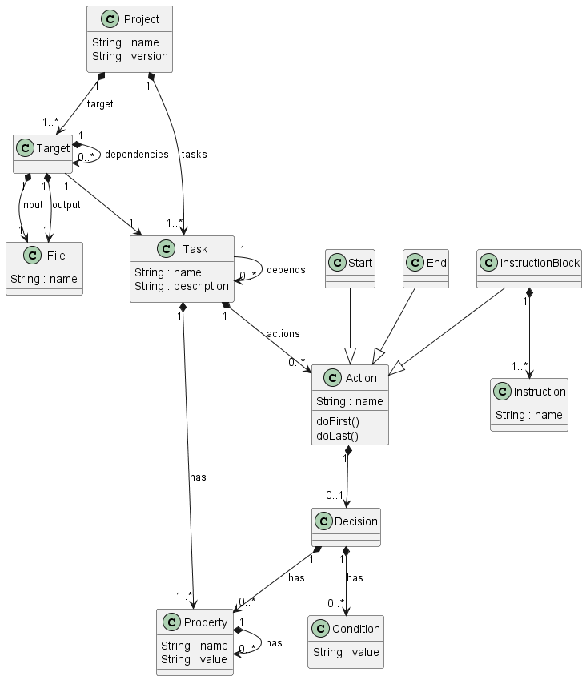
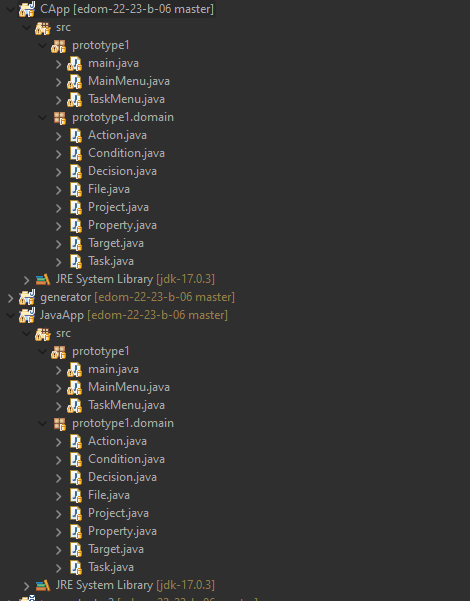
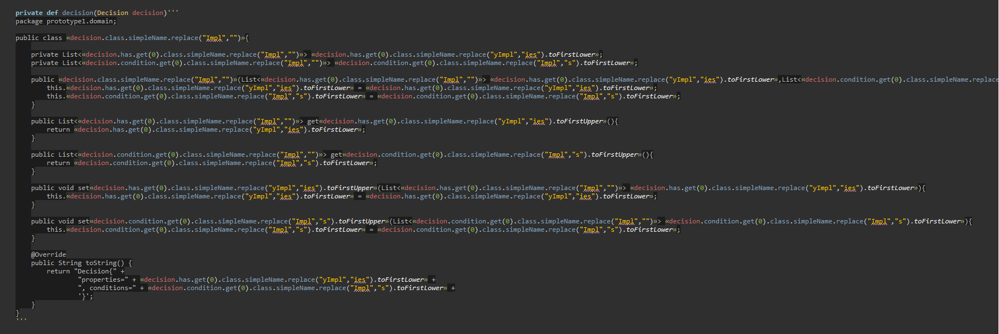
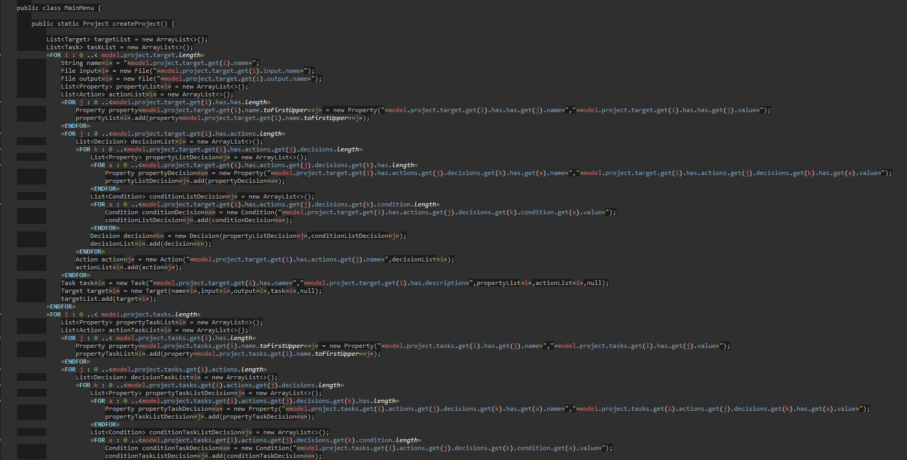
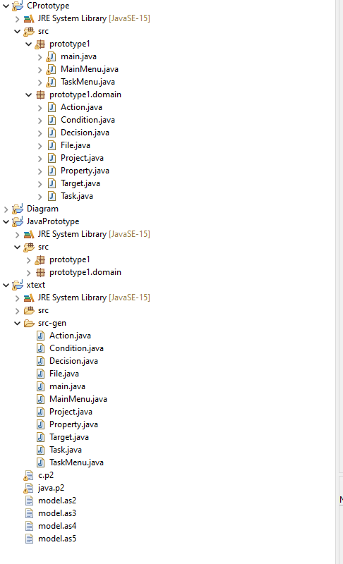

# EDOM Project, Part 2, Tool 2

In this folder you should add **all** artifacts developed for part 2 of the EDOM Project, related to tool 2.

You should also include in this file the report for this part of the project (only for tool 2).

## Description of the Tool

Xtext is a framework for development of programming languages and domain-specific languages. With Xtext you define your language using a powerful grammar language.
It covers all aspects of a complete language infrastructure, from parsers, over linker, compiler or interpreter to fully-blown top-notch IDE integration for Eclipse and Web-based IDEs. Further, languages developed with Xtext can be integrated into editors supporting the Language Server Protocol (like V.S Code). Xtext comes with great defaults for all these aspects, which at the same time can be easily tailored to your individual needs.

## Activity 1 - Design Concrete Syntax for the DSL

### New Metamodel

Basically we removed unnecessary actions such as ClosureBackedAction, DefaultAction and CustomAction. We also made the Decision Loop a lot easier. We removed the ifDecision, WhileDecision and LoopDecision and simply added the Type of Condition that can be "If","While,"Case".

We also removed the FileTarget and we came to the conclusion that a file input exists and it will generate a file output.

### New Constrains
| Model Class | Constrain|
| -------------- | :--------- |
| Task | Name must start with uppercase|
| Property | Name must start with uppercase |
| Target | Name must start with uppercase |

### New Refactoring
| Model Class | Transformation|
| -------------- | :--------- | 
| Task | Transforms first letter to capital | 
| Property | Transforms first letter to capital |  
| Target | Transforms first letter to capital | 

In order to implement this change in the Xtext, I only recreated the Xtext project using as base the update Ecore project.
After updating the Xtext project, since my team member uses Sirius, and my language uses a textual dsl, I decided that the implemented changes were already correct, so I didn't change the textual dsl any further.

## Activity 2 - Specify Common Features for Applications of the Domain

Team section only.

## Activity 3 - Implement Prototypes of Applications of the Domain

Considering the common features for Applications of the Domain, two prototypes were created.
The models from p1 were considered to create both prototypes.
So one uses the model that was created to Build Java Files and the other is based on the model to Compile a C file.

## Activity 4 - Identify Commonality and Variability in the Code

Team section only.

## Activity 5 - Design and Implement Code Generation

In order to be able to do the Code Generation, the file generator.xtend was used. Here templates were used to create the Java classes needed for the creation of the application. As long as there are no errors in the model file this will generate the java files properly and the app that will be generated will work. After running a second Eclipse instance and having the models created/saved, xtext generates the code present in the generator.xtend file. The files created by the generator go to the src-gen folder of the xtext project present in the second eclipse instance.

To understand better how templates worked the following site was used: [Xtend templates](https://www.eclipse.org/xtend/documentation/203_xtend_expressions.html#templates).

## Activity 6 - Generate Applications

After generating the java files, a new java project was created inside the second eclipse instance. Inside the projects 2 packages were created one called prototype and one called domain (inside the prototype). Java classes related to the domain were moved to the domain package and the rest were moved to the prototype package. It was also needed to create imports.

The main issues found during the testing were that in Xtext you can't say the place where you want the files to be generated. They will alwaysbe created in src-gen folder. This is different to Ecore, because there you can create the files already packaged. The second problem is that in order to make the app more universal, I didn't put imports, so that makes it so that you need to do the imports after creating the Java project.
