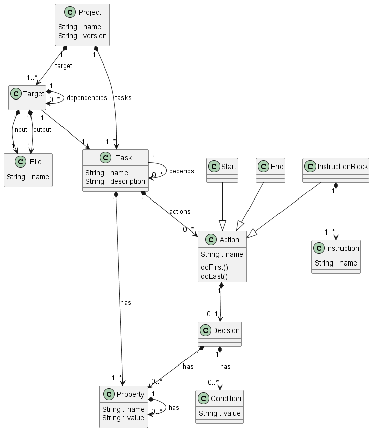
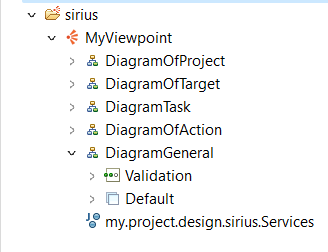
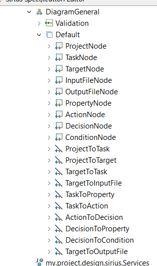
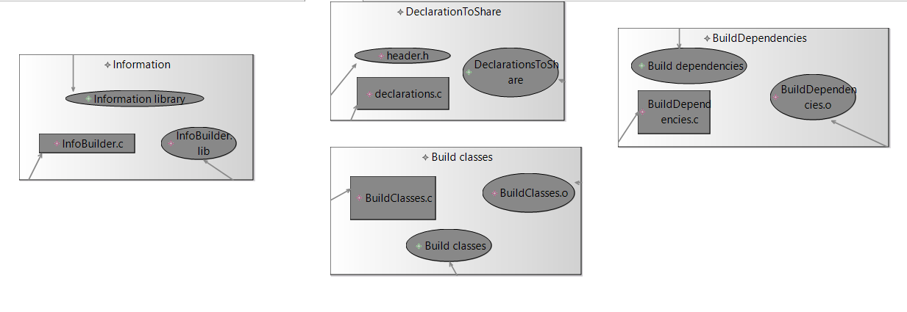
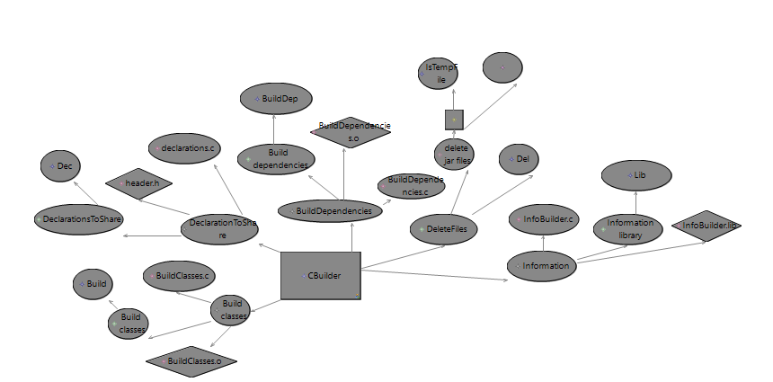
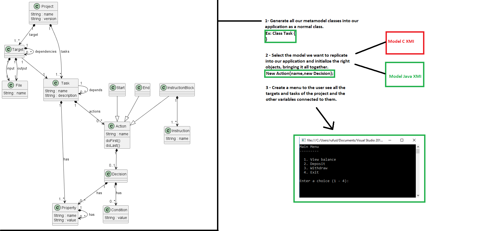
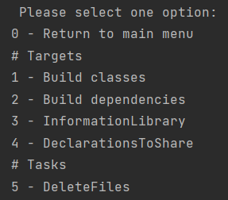
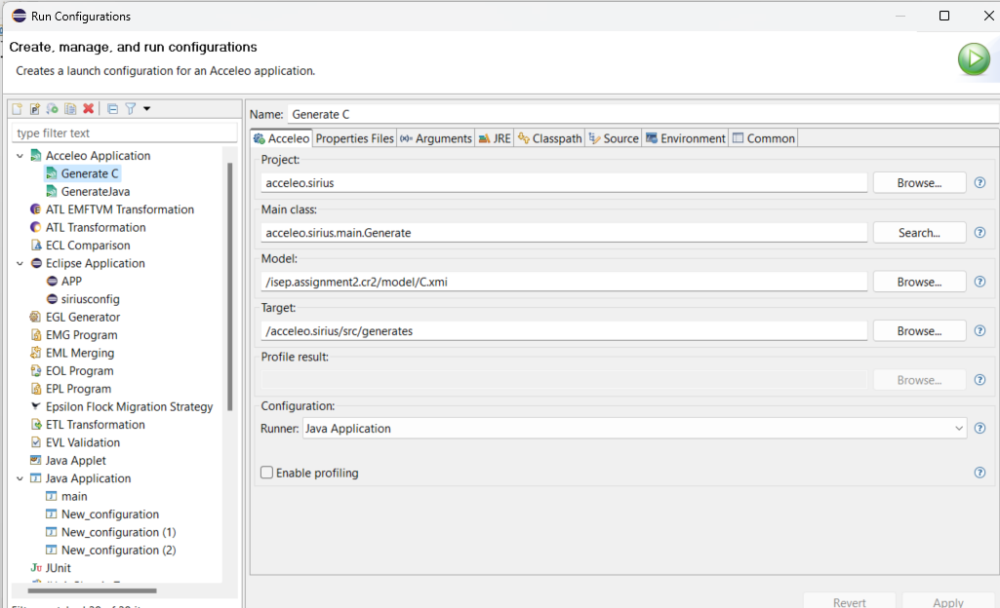
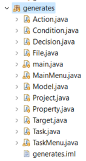

# EDOM Project, Part 2, Tool 3

In this folder you should add **all** artifacts developed for part 2 of the EDOM Project, related to tool 3.

You should also include in this file the report for this part of the project (only for tool 3).

**Note:** If for some reason you need to bypass these guidelines please ask for directions with your teacher and **always** state the exceptions in your commits and issues in bitbucket.

Following there are examples of proposed sections for the report.

# Design Concrete Syntax for the DSL.

First of all, after our Part 1 of this project we needed to make some changes to our metamodel in general, add some constrains and transformations.

## New Metamodel


Basically we removed unnecessary actions such as ClosureBackedAction, DefaulAction and CustomAction. We also made the Decision Loop a lot easier. Removing the ifDecision, WhileDecision and LoopDecision we simply added the Type of Condition that can be "If","While,"Case"..

We also removed the FileTarget and we simply came to the conclusion that a file input exists and it will generate a file output.

## New Constrains
| Model Class | Constrain| Code |
| -------------- | :--------- | :---------- | 
| Task | Name must start with uppercase| self.name.substring(1,1).toUpper().compareTo(self.name.substring(1,1))=0;| 
| Property | Name must start with uppercase | self.name.substring(1,1).toUpper().compareTo(self.name.substring(1,1))=0;| 
| Target | Name must start with uppercase | self.name.substring(1,1).toUpper().compareTo(self.name.substring(1,1))=0;| 

## New Refactoring
| Model Class | Transformation|
| -------------- | :--------- | 
| Task | Name must start with uppercase| 
| Property | Name must start with uppercase |  
| Target | Name must start with uppercase | 

## Graphical Representation 

As we know Sirius is a graphical tool itself so what we did here was making the visual representation more complex.

We created 5 types of diagrams:



Each one of them gives us a different view of our C and Java models.

I also created a general one that contains all the classes of our metamodel as Nodes and links them together, giving the user a better experience of this graphical tool and understanding of our metamodel.



## Model C representations 

Diagram of Target:



DiagramGeneral:



# Implement Prototypes of Applications of the Domain

## Application Scructure

Our team when we start to think of the right application to our DSL'S we thought the best solution would be having our metamodel elements be generated into domain classes and create new Instances of them and create objects according to our models, both in Java and C.

## Prototype



## Prototype Application

First we build our metamodel elements classes, here we can see an example with the Action.

```
package generates;

import java.util.List;

public class Action{
	
	private String name;
	private List<Decision> decisions;
	
	public Action(String name,List<Decision> decisions){
		this.name = name;
		this.decisions = decisions;
	}
			
	public String getName(){
		return name;
	}
			
	public void setName(String name){
		this.name = name;
	}
	
	public List<Decision> getDecisions(){
		return decisions;
	}
	
	public void setDecisions(List<Decision> decisions){
		this.decisions = decisions;
	}
}
```

After all the metamodel classes were created we initialize some variables and created some structures.

```
	List<Target> targetList = new ArrayList<>();
	List<Task> taskList = new ArrayList<>();
	List<Property> propList = new ArrayList<>();
	List<Property> propListDecision = new ArrayList<>();
	List<Action> actionList = new ArrayList<>();
	List<Decision> decisionList = new ArrayList<>();
	List<Condition> conditionList = new ArrayList<>();


	propList.add(new Property("Del","del" ));
    conditionList.add(new Condition("if"));
	propListDecision.add(new Property("IsTempFile","boolean "));
	decisionList.add(new Decision(propListDecision,conditionList));
	conditionList = new ArrayList<>();
	propListDecision = new ArrayList<>();
	actionList.add(new Action("Delete jar files",decisionList));
	decisionList = new ArrayList<>();
    taskList.add(new Task("DeleteFiles","task to delete the temporary files generated by the build",propList,actionList,null));
    actionList = new ArrayList<>();
    propList = new ArrayList<>();
    actionList = new ArrayList<>();

```
After all of this we created a simple console Menu where we can see all of the targets and tasks of our project being displayed.



# Design and Implement Code Generation

The common parts of the code that will be generated here are the Menu and the Domain Classes.

It doesn't matter which tool is used, what will vary from tool to tool is simply the way we go through the models to instantiate the variables.

Common parts always generated:
- Action.java
- Condition.java
- Decision.java
- File.java
- Model.java
- Project.java
- Property.java
- Target.java
- Task.java
- main.java
- TaskMenu.java

Variable parts:
- MainMenu.java (createProject() method)

Sirius is not able to generate code so we used Acceleo for this. Acceleo receives a .xmi file and converts it into code using a .mtl file. The process of doing the code generation relies on this file.

The next line of code is fundamental to our process : 
```
[template public generateElement(aClass : Model)]
[comment @main/]
```

Using the aClass variable that represents our Model class we can go through our xmi file completely and get all the values ​​needed to instantiate our variables.

The next piece of code shows how we we go through the xmi file in several for loops to instantiate the variables in the correct order and thus we build our most important method of the application , createProject() .

```
[file (('MainMenu.java'), false, 'UTF-8')]
package generates;

import java.util.ArrayList;
import java.util.List;
import java.util.Scanner;
import static java.lang.System.exit;

public class MainMenu {
	
	public static Project createProject() {
	
		List<Target> targetList = new ArrayList<>();
		List<Task> taskList = new ArrayList<>();
		List<Property> propList = new ArrayList<>();
		List<Property> propListDecision = new ArrayList<>();
		List<Action> actionList = new ArrayList<>();
		List<Decision> decisionList = new ArrayList<>();
		List<Condition> conditionList = new ArrayList<>();


[for (t : Task | aClass.project.tasks)]
	[for (p : Property | t.has)]
		propList.add(new Property("[p.name/]","[p.value/]" ));
	[/for]
	[for (a : Action | t.actions)]
			[for (d : Decision | a.decisions)]		
				[for (c : Condition | d.condition)]
				conditionList.add(new Condition("[c.value/]"));
				[/for]
				[for (p : Property | d.has)]
					propListDecision.add(new Property("[p.name/]","[p.value/] "));
				[/for]
			decisionList.add(new Decision(propListDecision,conditionList));
			conditionList = new ArrayList<>();
			propListDecision = new ArrayList<>();
			[/for]
	actionList.add(new Action("[a.name/]",decisionList));
	decisionList = new ArrayList<>();
	[/for]
taskList.add(new Task("[t.name/]","[t.description/]",propList,actionList,null));
actionList = new ArrayList<>();
propList = new ArrayList<>();
actionList = new ArrayList<>();
[/for]

[for (t : Target | aClass.project.target)]
	[for (p : Property | t.has.has)]
		propList.add(new Property("[p.name/]","[p.value/]" ));
	[/for]
	[for (a : Action | t.has.actions)]
			[for (d : Decision | a.decisions)]		
				[for (c : Condition | d.condition)]
				conditionList.add(new Condition("[c.value/]"));
				[/for]
				[for (p : Property | d.has)]
					propListDecision.add(new Property("[p.name/]","[p.value/]" ));
				[/for]
			decisionList.add(new Decision(propListDecision,conditionList));
			conditionList = new ArrayList<>();
			propListDecision = new ArrayList<>();
			[/for]
	actionList.add(new Action("[a.name/]",decisionList));
	decisionList = new ArrayList<>();
	[/for]
targetList.add(new Target("[t.name/]", new File("[t.input.name/]"), new File("[t.output.name/]"),new Task("[t.has.name/]","[t.has.description/]",propList,actionList,null),null));
propList = new ArrayList<>();
actionList = new ArrayList<>();
[/for]

Project project = new Project("[aClass.project.name/]","[aClass.project.version/]",targetList,taskList);
		return project;

	}
```

After this all the code we needed it's in our .mtl file, we just need to generate the applications now.


# Generate Applications

To generate our applications related to our Java and C models, we just need to create new configurations to run the Acelleo application.

Configuration Model C:



With the Java Model it's the same, we just need to change our Model field to the Java xmi.
The target represents were the classes will be generated.

If we run our project we will see all the classes in the generates package.



Now, let's run it as Java Application with the C model and search for our Task Delete Files.

```
 Please select one option:
0 - Exit
1 - Execute Tasks
1
 Please select one option:
0 - Return to main menu
# Targets
1 - Build classes
2 - Build dependencies
3 - InformationLibrary
4 - DeclarationsToShare
# Tasks
5 - DeleteFiles
5
Task DeleteFiles
Task Description - task to delete the temporary files generated by the build
Properties [Property -> Name: Del, Value: del]
Action Delete jar files
Action Decisions [Decision{properties=[Property -> Name: IsTempFile, Value: boolean ], conditions=[Condition{value='if'}]}]
```

As we can see we are able to see it and its components.

Let's try the same with the Java model but this time around with the Target Create Jars

```
 Please select one option:
0 - Exit
1 - Execute Tasks
1
 Please select one option:
0 - Return to main menu
# Targets
1 - Build classes
2 - Create Jars
3 - NonExplicit
# Tasks
4 - DeleteFiles
2
#Target Create
#Input File CreateAJar.class
#Output File CreateAJar.jar
#Task Name Create Jars
#Task Property[Property -> Name: Dist, Value: dist]
```
The code generation was a success and both models,C and Java, were represented as they should.
